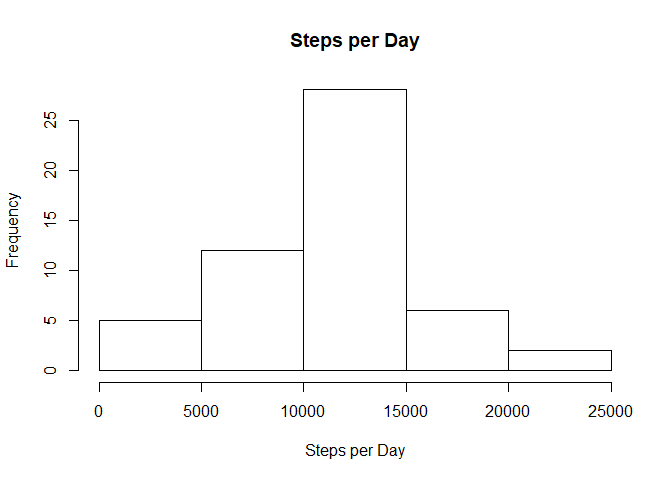
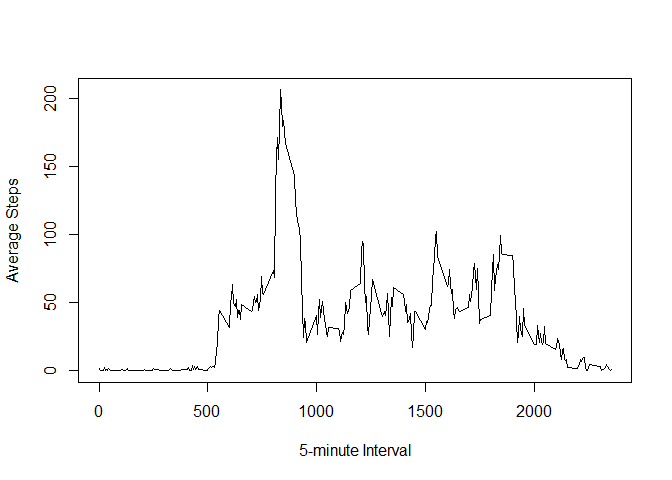
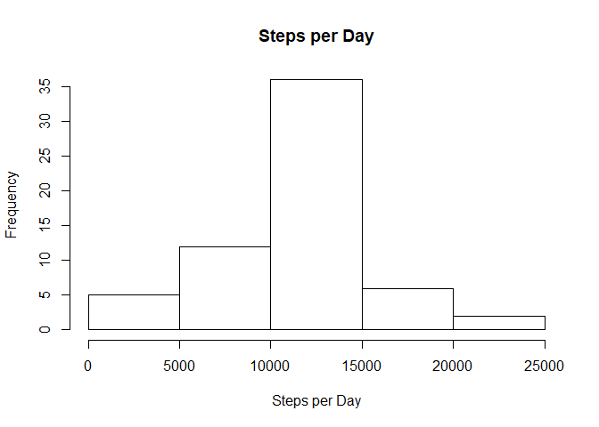
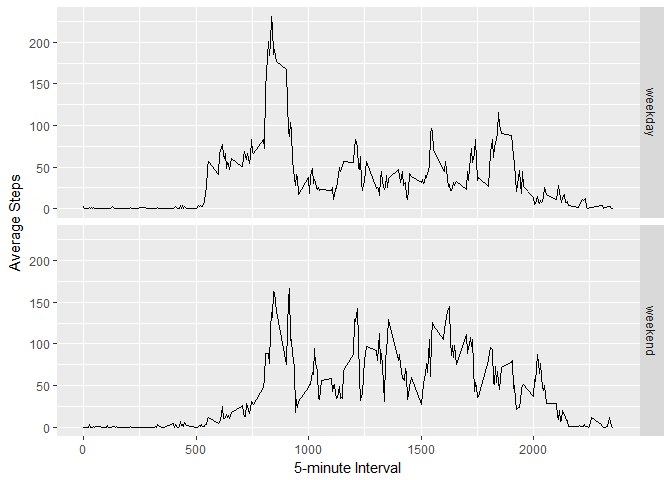

## Loading and preprocessing the data

```r
# Read data from CSV
data <- read.csv(unz("activity.zip", "activity.csv"),
                 header=TRUE,
                 sep=",",
                 na.strings="NA")
# Convert dates
data$date <- as.Date(data$date, format="%Y-%m-%d")
```

## What is mean total number of steps taken per day?

```r
library(dplyr)
```

```r
# Calculate total steps per day
steps_by_date <- summarize(group_by(data, date), ttl_steps = sum(steps))
# Make histogram
hist(steps_by_date$ttl_steps, main = "Steps per Day", xlab = "Steps per Day")
```

<!-- -->

```r
# Calculate mean ...
mean(steps_by_date$ttl_steps, na.rm = TRUE)
```

```
## [1] 10766.19
```

```r
# ... and median
median(steps_by_date$ttl_steps, na.rm = TRUE)
```

```
## [1] 10765
```

## What is the average daily activity pattern?

```r
# Calculate average steps per interval
avg_steps_by_interval <-
    summarize(group_by(data, interval),
    avg_steps = mean(steps, na.rm = TRUE))
# Make plot
with(avg_steps_by_interval, plot(interval, avg_steps, type = "l",
                                 xlab = "5-minute Interval",
                                 ylab = "Average Steps"))
```

<!-- -->

```r
# Find 5-minute interval with max steps
avg_steps_by_interval$interval[avg_steps_by_interval$avg_steps == max(avg_steps_by_interval$avg_steps)]
```

```
## [1] 835
```

## Imputing missing values

```r
# Count NAs
sum(is.na(data$steps))
```

```
## [1] 2304
```

```r
# Replace NAs with mean value for current interval
data_full <-
    mutate(group_by(data, interval), steps =
               ifelse(is.na(steps), ceiling(mean(steps, na.rm = TRUE)), steps))
steps_by_date <- summarize(group_by(data_full, date), ttl_steps = sum(steps))
# Make histogram
hist(steps_by_date$ttl_steps, main = "Steps per Day", xlab = "Steps per Day")
```

<!-- -->

```r
# Calculate mean ...
mean(steps_by_date$ttl_steps, na.rm = TRUE)
```

```
## [1] 10784.92
```

```r
# ... and median
median(steps_by_date$ttl_steps, na.rm = TRUE)
```

```
## [1] 10909
```

## Are there differences in activity patterns between weekdays and weekends?

```r
# Make factor variable
data_full$day_type <- as.factor(format(data_full$date, "%u") %in% c(6, 7))
levels(data_full$day_type) <- c("weekday","weekend")

library(ggplot2)
avg_steps_by_interval <-
    summarize(group_by(data_full, day_type, interval), avg_steps = mean(steps, na.rm = TRUE))
# Make plot
ggplot(avg_steps_by_interval, aes(interval, avg_steps)) +
    geom_line() +
    facet_grid(day_type~.) +
    xlab("5-minute Interval") + 
    ylab("Average Steps") +
    theme(plot.title = element_text(hjust = 0.5))
```

<!-- -->

Conclusion: activity pattern is more even on weekend than on weekday
